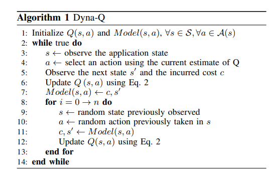
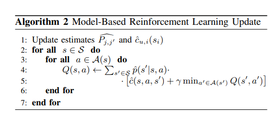

# Horizontal and Vertical Scaling of Container-based Applications using Reinforcement Learning

2019 IEEE CLOUD

## Introduction

* 同时实现水平缩放和垂直缩放。

* 提出一种新的基于模型的强化学习方法。

* 为了加快学习过程并确定更好的适应策略，我们提出了RL解决方案，利用不同程度的系统动力学知识（即Q-学习、Dyna-Q和基于模型）。

* 在Elastic Docker Swarm中实现。

## RL-formulation

* 状态空间: 我们将时间 i 的应用程序状态定义为 si = （ki， ui， ci），其中 ki 是容器的数量（即应用程序实例），ui 是 CPU 利用率，ci 是授予每个容器的 CPU 份额。我们用 S 表示所有应用程序状态的集合。尽管 CPU 利用率 （ui） 和 CPU 份额 （ci） 是实数，但我们通过固定的份额将其离散化。

* 动作空间: 
    * 5-action model: A = {-r, -1, 0, 1, r}，其中 +1 表示增加一个容器，-1 表示删除一个容器。+r 和 -r 表示增加和删除CPU资源。
    * 9-action model: A = {-1, 0, 1} X {-r, 0, r}。9-action model 与 5-action model 的区别在于, 9-action model 可以同时执行水平和垂直缩放。
    * 由于资源约束的存在，有时候动作空间受限制。

* 成本函数:
    * 目标: a) 减少调整次数，b) 保证应用程序性能，c) 避免资源浪费。
    * 适应成本 $C_{adp}$，用于描述缩放后的应用程序不可用性。为了学习适应成本，考虑一个简化的模型就足够了，该模型引入了对垂直扩展行动的持续惩罚。事实上，水平扩展决策不会影响应用程序的可用性，因为它们可以通过简单地启动/终止容器来执行。
    * 性能损失 $c_{perf}$，对当应用程序超过响应时间限制 $R_{max}$的惩罚。
    * 运行应用程序的资源成本 $C_{res}$。我们假设成本与应用程序实例数和分配的 CPU 份额成正比。
    * $\begin{aligned} c\left(s, a, s^{\prime}\right)=& w_{\mathrm{adp}} \frac{\mathbb{1}_{\{\text {vertical-scaling }\}} c_{\mathrm{adp}}}{c_{\text {adp }}}+\\ &+w_{\text {perf }} \frac{\mathbb{1}_{\left\{R\left(k+a_1, u^{\prime}, c+a_2\right)>R_{\max }\right\}} c_{\text {perf }}}{c_{\text {perf }}}+\\ &+w_{\text {res }} \frac{\left(k+a_1\right)\left(c+a_2\right) c_{\text {res }}}{K_{\max } \cdot c_{\mathrm{res}}} \\=& w_{\text {adp }} \mathbb{1}_{\{\text {vertical }-\text { scaling }\}}+\\ &+w_{\text {perf }} \mathbb{1}_{\left\{R\left(k+a_1, u^{\prime}, c+a_2\right)>R_{\max }\right\}}+\\ &+w_{\text {res }} \frac{\left(k+a_1\right)\left(c+a_2\right)}{K_{\max }} \end{aligned}$
    * $1\{ ·\}$ 是指标函数，$R(k, u, c)$ 是应用程序的响应时间，$K_{max}$ 是应用程序的最大实例数，$w_{adp}$ 等是各项权重。

## Dyna-Q

传统Q-learning中Q表更新如下：

$Q(s, a)=Q(s, a)+\alpha\left(r+\gamma \max _{a^{\prime}} Q\left(s^{\prime}, a^{\prime}\right)-Q\left(s, a\right)\right)$

网络使用TD-Loss, $w$为神经网络权重: $L(w)=\mathbb{E}\left[\left(r+\gamma \max _{a^{\prime}} Q\left(s^{\prime}, a^{\prime}, w\right)-Q(s, a, w)\right)^2\right]$

其中论文作者写成这种形式：

$Q\left(s_i, a_i\right) \leftarrow(1-\alpha) Q\left(s_i, a_i\right)+\alpha\left[c_i+\gamma \min _{a^{\prime} \in \mathcal{A}\left(s_{i+1}\right)} Q\left(s_{i+1}, a^{\prime}\right)\right]$

与Q学习不同，Dyna-Q旨在通过模拟系统与环境的交互来加速学习过程。

## Model-Based Reinforcement Learning

作为第三种策略，我们考虑基于完整模型的强化学习方法。在完整备份方法中，我们依赖于可能近似的系统模型，并直接使用贝尔曼方程来计算Q函数。

$Q(s, a)=\sum_{s^{\prime} \in \mathcal{S}} p\left(s^{\prime} \mid s, a\right)\left[c\left(s, a, s^{\prime}\right)+\gamma \min _{a^{\prime} \in \mathcal{A}\left(s^{\prime}\right)} Q\left(s^{\prime}, a^{\prime}\right)\right] \quad \begin{gathered}\forall s \in \mathcal{S}, \\ \forall a \in \mathcal{A}(s)\end{gathered}$

这里使用实验估计直接得到概率转移$p\left(s^{\prime} \mid s, a\right)$和代价函数$c\left(s, a, s^{\prime}\right)$

$\begin{aligned} p\left(s^{\prime} \mid s, a\right) &=P\left[s_{i+1}=\left(k^{\prime}, u^{\prime}, c^{\prime}\right) \mid s_i=(k, u, c), a_i=a\right] \\ &= \begin{cases}P\left[u_{i+1}=u^{\prime} \mid u_i=u\right] & k^{\prime}=k+a_1 \wedge \\ 0 & \wedge c^{\prime}=c+a_2 \\ 0 & \text { otherwise }\end{cases} \end{aligned}$

Cost由$known \ cost$和$unknown \ cost$组成：$c\left(s, a, s^{\prime}\right)=c_k(s, a)+c_u\left(s^{\prime}\right)$

