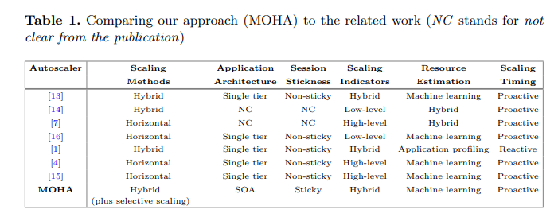
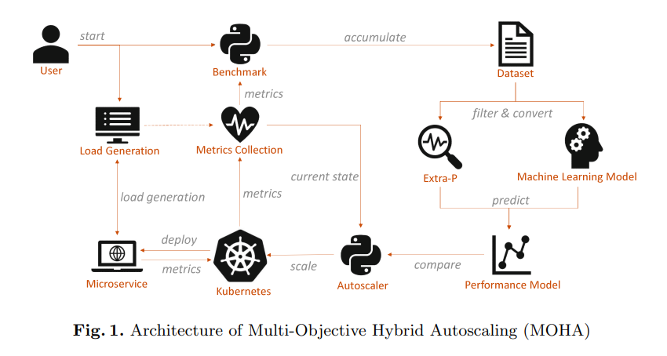

# Multi-objective Hybrid Autoscaling of Microservices in Kubernetes Clusters

本文发表在 Euro-Par 2022(CCF-C): https://dl.acm.org/doi/abs/10.1007/978-3-031-12597-3_15

代码: https://github.com/Angi2412/Multi-Objective-Hybrid-Autoscaing-MOHA

## Introduction

Kubernetes 可以进行

* 横向扩展（horizontal pod autoscaling）：增加副本的个数
* 纵向扩展（Vertical pod autoscaling）：调整服务的大小

现有的工作包括：

其中，[1]是量测每个应用的性能上限（bottleneck），然后根据bottleneck进行缩放。[14]是谷歌Autopilot。[13]是IEEE CLOUD 2019 的一篇文献，使用RL方法进行横向纵向混合缩放。

*scaling timing* 可以是*Reactive*的，也可以*Proactive*的。通过*Reactive* 缩放，自动缩放器将只对给定的情况作出反应并尝试抵消它。与此相反，使用*Proactive*方法，自动缩放器通过提前执行缩放操作来避免某些情况，如资源耗尽。预测可以基于给定的数据趋势和模式或外部数据。
*Scaling indicators*可以由低级指标，例如CPU使用率。也可以是高级指标，例如QPS或者响应时间。

我们提出的方法面向使用有状态的面向服务架构（SOA）。它使用高级别和低级别指标作为扩展指标。通过基于机器学习的性能模型来估计资源需求。由于性能模型基于历史数据，因此*scaling timing* 被归类为*Proactive*。可以实现horizontally, vertically or by combination of both approaches的缩放方式。我们使用多标准决策理论（multiple criteria decision making
theory），它具有针对特定目的调整权重的灵活性（例如，扩展数据密集型或计算密集型服务）。

## Method

### ML Model

我们基于服务的当前负载和部署微服务的pod的资源限制，对每个微服务的性能进行建模。资源限制包括CPU和内存限制，以及pod副本的数量，这是在Kubernetes中定义pod时的典型输入参数。微服务的负载由每秒的请求动态表示。模型的输出（目标指标）是平均响应时间、CPU使用率和内存使用率。模型使用的是SVR，LR，MLP。

### 缩放算法

首先，Autoscaler收集微服务的当前状态。它调用`Prometheus`实例，该实例从服务网格（Service Mesh）`Linkerd`收集高级度量，从Kubernetes本身收集低级度量。然后检查目标指标。如果所有目标都在它们的阈值范围内，这意味着目标是令人满意的，那么循环将退出，微服务将不会扩展。但是，如果三个目标度量中的任何一个超过了阈值，则自动缩放循环将继续。

计算副本数的算法和HPA相同，即`desiredReplicas = ceil[currentReplicas * ( currentMetricValue / desiredMetricValue )]`也和这篇文章的算法相同[Kubernetes容器缩放量测什么样的指标更科学？](https://zhuanlan.zhihu.com/p/574775706)

计算每个副本的optimal resource limits

$p_i^{\text {optimal }}=\left\lceil p_i^{\text {current }} \cdot \frac{t_i^{\text {current }}}{t_i^{\text {desired }}}\right\rceil$

即，预估性能不达标时会降低单个部分最优资源分配。
